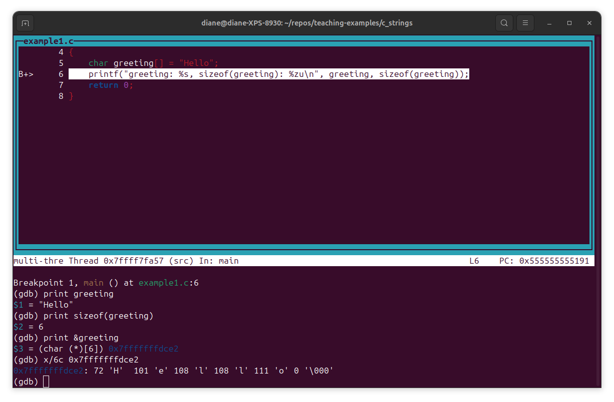
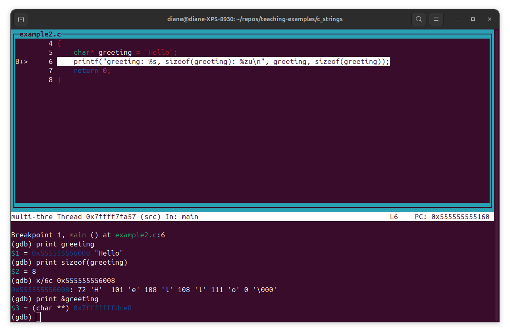

# C Strings - Character Array versus Character Pointer

Strings are used for storing text/characters. C does not have a **string** type. The **char** type is used to create an array of characters to make a string in C. Examples 1 and 2 illustrate the differences between using a character array and a character pointer to define a string.


## Example 1 - Character Array 

[Example 1](./example1.c) declares a character array variable named greeting and stores the string "Hello" in its memory.

The array size is not specified inside the brackets []. The compiler determines the array size by the number of characters in the string literal "Hello" plus one character for the null terminator character '\0'.

```c 
// example 1
#include <stdio.h>

int main()
{
    char greeting[] = "Hello";
    printf("greeting: %s, sizeof(greeting): %zu\n", greeting, sizeof(greeting));
    return 0;
}
```

Compile example1.c with the -g flag to include debugging symbols.

```bash
gcc -g example1.c -o example1

```


Start gdb with the executable name.

```bash
gdb ./example1 
```

Once gdb starts, run the commands shown below. Type commands shown to the right of the (gdb) prompt. layout src opens a terminal (text) user interface and shows the source code. We're setting a breakpoint at line 6 and then running the program to a point where the character array has been loaded into memory, but the print statement has not yet executed.

Next, run the gdb commands to show the string stored in the greeting array, the sizeof the greeting array, its address in memory, and then use the memory address to show the individual characters. Note that your memory address will be different from the one shown.

```bash 
(gdb) layout src
(gdb) b 6 
(gdb) run
(gdb) print greeting
(gdb) print sizeof(greeting)
(gdb) print &greeting 
(gdb) x/6c 0x7fffffffdce2
```


The image below shows gdb output. The array variable greeting has an address of 0x7fffffffdce2 in this example. Use that memory address with the x/6c command to examine raw memory. x/6c displays 6 memory units in character format (c), showing the individual characters and the null terminator (\0) that define the string.





The null terminator '\000' above is shown in its 3-digit octal representation. The output for sizeof(greeting) is 6 bytes.


## Example 2 - Character Pointer 

[Example 2](./example2.c) declares a char pointer named greeting and assigns the string literal "Hello" to the pointer.

```c 
// example 2
#include <stdio.h>

int main()
{
    char* greeting = "Hello";
    printf("greeting: %s, sizeof(greeting): %zu\n", greeting, sizeof(greeting));
    return 0;
}
```

Compile example1.c with the -g flag to include debugging symbols. Start GDB, show the program source code, set a breakpoint at line 6, run,and print greeting.


```bash
gcc -g example1.c -o example1
gdb ./example1 
(gbb) layout src
(gdb) b 6 
(gdb) run
(gdb) print greeting 
(gdb) x/6c 0x555555556008
```


The image below shows the debugger output. The result of print greeting is an address (0x555555556008) followed by the string "Hello". We use this address with the x/6c command to see the characters stored in memory. If we print the address of greeting, it is different from the address of the string literal "Hello".




## Summary Table: Differences between Character Array and Character Pointer 

| Feature | char greeting[] = "Hello"; | char* greeting = "Hello"; |
| --- | --- | --- |
| Type | Array of characters | Pointer to a character |
| Storage Location | Stack (declared locally) (or data segment if global/static) | Pointer on the stack. Literal in read-only memory |
| Modifiability | Modifiable contents | Unmodifiable contents (read-only) |
| sizeof result | Size of the entire array (6 bytes) | Size of the pointer itself (4 or 8 bytes) |
| Reassignment | Cannot be reassigned to point elsewhere | Can be reassigned to point to other memory |
| Usage | Use when you need a modifiable local copy of a string | Use when pointing to constant string or dynamic memory. Best practice for constant string is const char* | 


