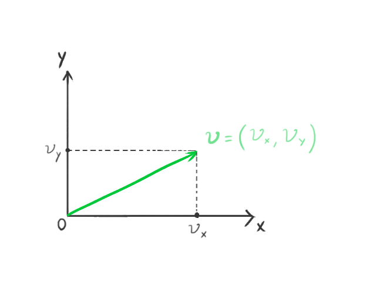
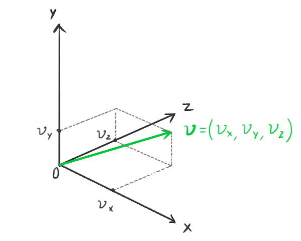
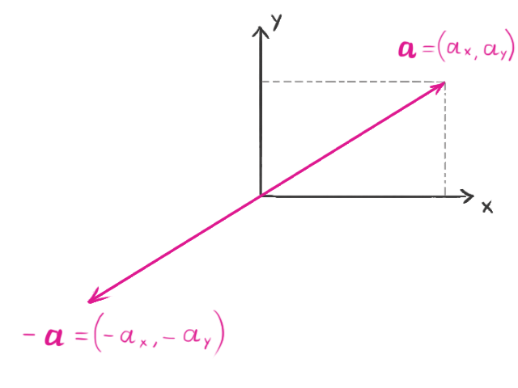
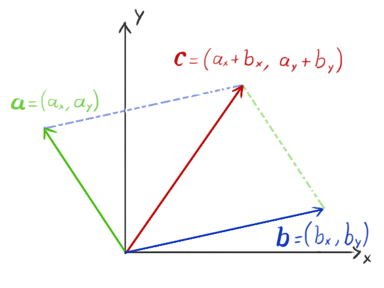
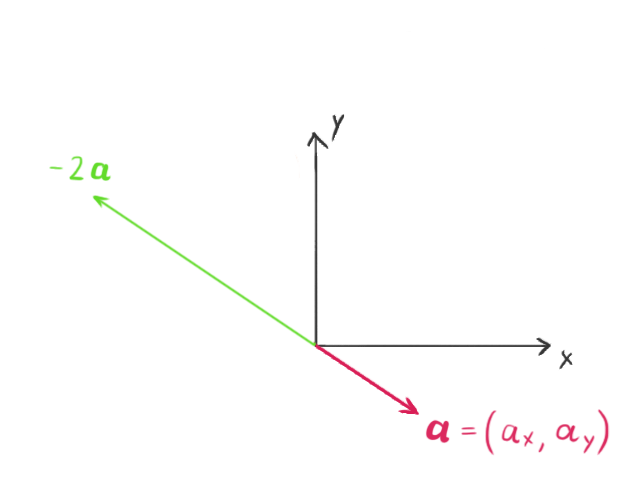

# Vectors

A vector is an entity that has a magnitude and a direction. We use a Cartesian coordinate system to represent it using two components, *x* and *y*, in a 2-dimensional space, or three components, *x*, *y*, and *z*, in a 3-dimensional space.  

 [1](https://uploads.toptal.io/blog/image/781/toptal-blog-image-1421917486683.png)

  

 [2](https://uploads.toptal.io/blog/image/782/toptal-blog-image-1421917499528.png)

  

We will represent a vector with a bold lowercase character, and its components with a regular subscripted character. For example:  

 <strong>a</strong> = (ax, ay)
 

represents a 2-dimensional vector. Each component is the distance from the origin in the corresponding coordinate axis.  

## Length (aka magnitude)

The length, or magnitude, operator is represented by || ||. The Pythagorean theorem for right triangles is use to compute the length from its components. For example, in 2 dimensions:

||a|| = sqrt(ax2 + ay2)
  

## Negation

When a vector is negated, the length remains the same, but the direction changes to the exact opposite. For example, given

 <strong>a</strong> = (ax, ay)
 

the negation is  

 <strong>-a</strong> = (-ax, -ay)
 

 [3](https://uploads.toptal.io/blog/image/787/toptal-blog-image-1421917686471.png)   

## Addition and Subtraction

Vectors can be added to each other, or one vector can be subtracted from another. Subtracting two vectors is the same as adding one to the negation of the other. These operations simply add or subtract each component.

**a** + **b** = (ax, ay) + (bx, by) = ((ax + bx, ay + by)) 

**a** - **b** = (ax, ay) - (bx, by) = ((ax - bx, ay - by)) 

The resulting vector can be visualized as pointing to the same point that the two original vectors would point if they were connected tip to tail.  

 [4](https://uploads.toptal.io/blog/image/789/toptal-blog-image-1421917713199.png)   

## Scalar Multiplication

A vector's length is changed when it is multiplied by a scalar real number. If the scalar is negative, the resulting vector will point in the opposite direction.

 <strong>a</strong>s = (ax s, ay s)
  

 [5](https://uploads.toptal.io/blog/image/791/toptal-blog-image-1421917737475.gif)  

## Dot Product

The dot product of two vectors is defined as

 <strong>a</strong> . <strong>b</strong> = ||<strong>a</strong>|| ||<strong>b</strong>|| cos &theta;
 

where &theta; is the angle between the two vectors. The dot product may be computed using the vector components.

 <strong>a</strong> . <strong>b</strong> = ax  bx + ay by
  

The value of the dot product is equivalent to the length of the projection of vector **a** onto the vector **b**, multiplied by the length of b. The projection of b onto produces the same scalar result. The dot product is commutative.  

## Cross Product

In three dimensions, we can multiply two vectors to produce an output vector that is orthogonal to the two input vectors.

 <strong>a</strong> x <strong>b</strong> = (ay  bz - az by, az  bx - ax bz, ax  by - ay bx
  

The cross product length is

 ||<strong>a</strong> x <strong>b</strong>|| = ||<strong>a</strong>|| ||<strong>b</strong>|| sin &phi;
 

where &phi; is the smallest angle between **a** and **b**. 

The cross product is not commutative. 

 <strong>a</strong> x <strong>b</strong> = <strong>-b</strong> x <strong>a</strong>
 
